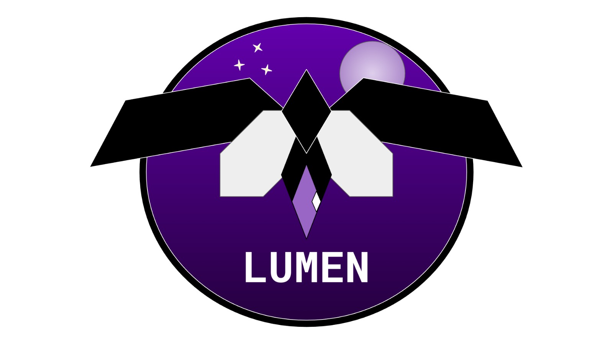

# Sistema de Controle e EStatística de Produtos em Estoque (SCESPE)

## Introdução
Esse repositório foi criado para o desenvolvimento do projeto SCESPE da disciplina de Requisitos de Software da Universidade de Brasília, durante o 1º semestre de 2024. A disciplina tem o objetivo de ensinar sobre os fundamentos da engenharia de requisitos, sendo uma área interdisciplinar da Engenharia de Software. O nosso projeto compreende uma aplicação web que visa gerir e analisar de forma automatizada um estoque de produtos.

## Equipe
A equipe SCESPE é formada pelos estudantes de Engenharia de Software da Universidade de Brasília apresentados a seguir.

| Foto        | Nome                                 | Github |
| :---------: | :----------------------------------: | :----: |
| { align=center, width="100" } | André Silva | [:fontawesome-brands-github: Hunter104](https://github.com/Hunter104) |
| { align=center, width="100" } | Bruno Menezes | [:fontawesome-brands-github: EhOBruno](https://github.com/EhOBruno) |
| { align=center, width="100" } | Carlos Alves | [:fontawesome-brands-github: CADU110](https://github.com/CADU110) |
| { align=center, width="100" } | Eduardo Sandes | [:fontawesome-brands-github: DiceRunner714](https://github.com/DiceRunner714) |
| { align=center, width="100" } | Henrique Quenino | [:fontawesome-brands-github: henriquecq](https://github.com/henriquecq) |
| { align=center, width="100" } | Larissa Vieira | [:fontawesome-brands-github: VieiraLaris](https://github.com/VieiraLaris) |
| { align=center, width="100" } | Vinícius Santos | [:fontawesome-brands-github: ViniciussdeOliveira](https://github.com/ViniciussdeOliveira) |

 Tabela 1: Equipe de trabalho (Fonte: autor, 2024).

## Histórico de versão
| Versão | Data | Descrição | Autor(es) | Revisor(es) |
| :----: | :--: | :-------: | :-------: | :---------: |
| `1.0` | 16/04/2024 | Versão inicial do documento de introdução | Vinícius Santos | Eduardo Sandes |