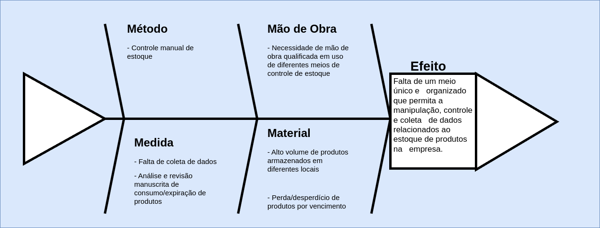
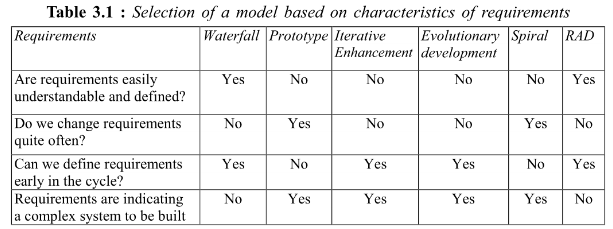
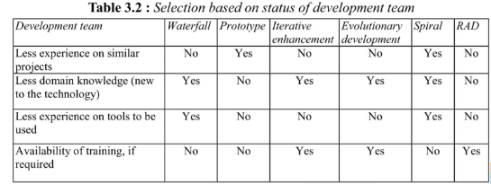
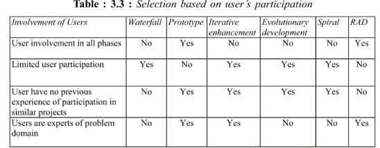
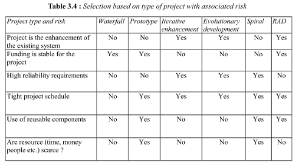
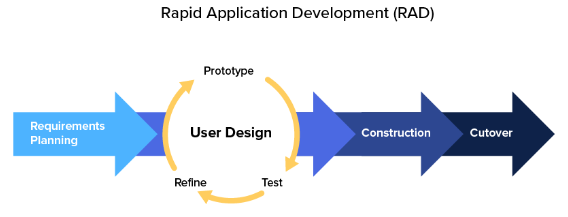
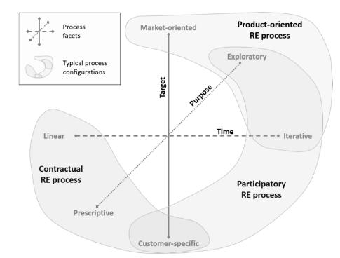
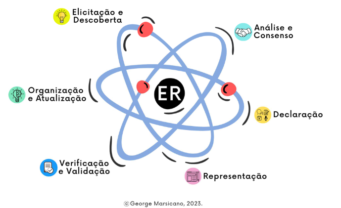
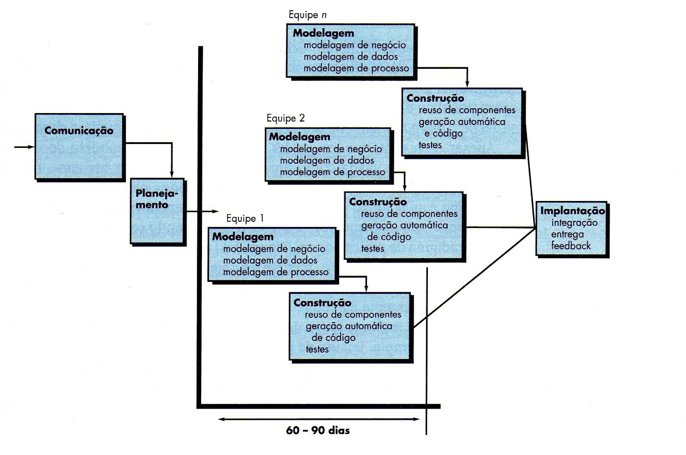

# VISÃO DE PRODUTO E PROJETO

## Histórico de Revisão
| Data | Versão | Descrição | Autor |
| ---- | ------ | --------- | ----- |
| 02/04/2024 | `0.1` | Criação do documento | Henrique Quenino, Vinicius Santos, André Silva, Bruno Menezes, Eduardo Sandes, Larissa Vieira, Carlos Eduardo Alves |
| 04/04/2024 | `0.2` | Evolução do documento | Henrique Quenino, Vinicius Santos, André Silva, Bruno Menezes, Eduardo Sandes, Larissa Vieira, Carlos Eduardo Alves |
| 08/04/2024 | `1.0` | Visão Geral do Produto | Henrique Quenino, Vinicius Santos, André Silva, Bruno Menezes, Eduardo Sandes, Larissa Vieira, Carlos Eduardo Alves |
| 16/04/2024 | `1.1` | Criação do documento no gitpages | Henrique Quenino, Vinicius Santos, André Silva, Bruno Menezes, Eduardo Sandes, Larissa Vieira, Carlos Eduardo Alves |
| 17/04/2024 | `2.0` | Revisão do documento e inclusão do vídeo da apresentação | Henrique Quenino, Vinicius Santos, André Silva, Bruno Menezes, Eduardo Sandes, Larissa Vieira, Carlos Eduardo Alves |
| 25/04/2024 | `2.1` | Conclusão das issues abertas após entrega da missão 1 | Henrique Quenino, Vinicius Santos, André Silva, Bruno Menezes, Eduardo Sandes, Larissa Vieira, Carlos Eduardo Alves |
| 27/04/2024 | `2.2` | Finalização da issue #6 | Henrique Quenino, Vinicius Santos, André Silva, Bruno Menezes, Eduardo Sandes, Larissa Vieira, Carlos Eduardo Alves |

## 1. VISÃO GERAL DO PRODUTO
### 1.1 Problema
O problema se constitui, na organização de um depósito central de nove unidades da rede de Ensino Biângulo, cuja gestão requer o controle rigoroso da entrada e saída de suprimentos e produtos, da emissão de etiquetas com códigos de barras individuais para cada item recebido, bem como o acompanhamento minucioso das quantidades armazenadas. Além disso, é fundamental a geração de dados estatísticos. Destaca-se também a problemática de comunicação e distribuição de produtos entre todas as unidades conforme suas respectivas necessidades e os pedidos realizados.  

Figura 1 - Diagrama de Ishikawa (fonte: autores, 2024)

### 1.2 Declaração de Posição do Produto

| Para | Rede Colégio Biângulo |
| ---- | --------------------- |
| Quem | Necessita-se gerir eficientemente o depósito das várias unidades do colégio |
| O SCESPE | É um sistema eficiente de controle de estoque Escolar |
| Que | Auxílio na gestão de estoque escolar, integrando o estoque das unidades para uma análise geral e específica. |
| Ao contrário | Planilhas digitais, manuscrita ou afins |
| Nosso produto | Ofertará controle centralizado e sincronizado de informação, possibilitará o monitoramento através de etiquetas geradas automaticamente, e haverá controle sobre restrições de acesso e manipulação do estoque. |

### 1.3 Objetivos do Produto

O objetivo do produto é resolver a gestão do depósito central da rede de Ensino Biângulo. Isso inclui gerenciar autorizações do manejo de suprimentos, emitir etiquetas com códigos de barras para identificação dos itens, acompanhar as quantidades em estoque em tempo real e gerar dados estatísticos para uma gestão mais eficaz. Além disso, visa controlar por parte da central, a distribuição dos produtos para as unidades filhas conforme suas necessidades e pedidos.

### 1.4 Tecnologias a Serem Utilizadas
- Python 
- Django
- HTML
- CSS
- JavaScript
- Node.js
- MySQL

## 2. VISÃO GERAL DO PROJETO
### 2.1 Organização do projeto

| Papel | Atribuições | Responsável | Participantes |
| ----- | ----------- | ----------- | ------------- |
| Desenvolvedor |  Codificar o produto, codificar testes unitários, realizar refatoração. Também é responsável pela **Elicitação e Descoberta**, além da **Representação** dos requisitos. | Henrique Quenino | Vinicius Santos, André Silva, Bruno Menezes, Eduardo Sandes, Larissa Vieira, Carlos Alves |
| Dono do produto | Atualizar o escopo do produto, organizar o escopo das sprints, validar as entregas. Responsável pela **Análise e Consenso**, além da **Organização e Atualização** dos requisitos. | Carlos Alves | Henrique Quenino, Vinicius Santos, André Silva, Bruno Menezes, Eduardo Sandes, Larissa Vieira |
| Analista de Qualidade | Garantir a qualidade do produto, garantir o cumprimento do conceito de pronto, realizar inspeções de código. Responsável pela **Verificação e Validação** dos requisitos. | Vinicius Santos | Henrique Quenino, André Silva, Bruno Menezes, Eduardo Sandes, Larissa Vieira, Carlos Alves |
| Cliente | Validar o trabalho entregue, eleger a prioridade dos requisitos. Responsável pela **Declaração** dos requisitos. | Fabrício Felix | Fabrício Felix |
| Monitor | Orientar as equipes e auxiliar no processo de desenvolvimento | Ana Fernandes | Ana Fernandes |

### 2.2 Planejamento das Fases e/ou Iterações do Projeto

| Ciclos | Produto (Entrega) | Data Início | Data Fim |
| ------ | ----------------- | ----------- | -------- |
| Ciclo 1 | Definição do Produto | 18/03/24 | 11/04/24 |
| Ciclo 2 | Planejamento do Projeto | 11/04/24 | 18/04/24 |
| Ciclo 3 | Definição do Backlog do produto | 01/05/24 | 08/05/24 |
| Ciclo 4 | Definição do MVP  | 09/05/22 | 15/05/24 |
| Ciclo 5 | Funcionalidades: 1, 2 | 16/05/24 | 22/05/24 |
| Ciclo 6 | Funcionalidades: 3, 4 | 23/05/24 | 29/05/24 |
| Ciclo 7 | Funcionalidades: 5, 6 | 30/05/24 | 05/06/24 |
| Ciclo 8 | Funcionalidades: 7, 8 | 06/06/24 | 12/06/24 |
| Ciclo 9 | Funcionalidades: 9, 10 | 13/06/24 | 19/06/24 |
| Ciclo 10 | Entrega final do projeto | 20/06/24 | 28/06/24 |

### 2.3 Matriz de comunicação

| Descrição | Área/Envolvidos | Periodicidade | Produtos Gerados |
| --------- | --------------- | ------------- | ---------------- |
| Acompanhamento das atividades em andamento | Equipe do projeto | Semanal | Ata de Reunião |
| Acompanhamento dos Riscos, Compromissos, Ações Pendentes, Indicadores | Equipe do projeto com cliente | Quinzenal | Relatório de situação do projeto |
| Comunicar situação do projeto | Equipe do projeto e professor | Semanal | Ata de Reunião e Relatório de situação do projeto |

### 2.4 Gerenciamento de Riscos

| Risco | Causa | Probabilidade | Estratégia |
| ----- | ----- | ------------- | ---------- |
| Falta de comunicação | Incompatibilidade de horário, ausência de disponibilidade assíncrona | Baixa | Repensar na maneira que está sendo realizada a comunicação entre os integrantes |
| Redução na equipe | Doenças, trancamento de disciplina, problemas pessoais | Média | Redistribuição das atividades para os membros da equipe |
| Desenvolvimento equivocado | Má definição do Backlog do produto | Baixa | Revisão dos requisitos levantados e feedback do cliente |
| Sobrecarga de membros | Redução da equipe, funcionalidades subestimadas, demandas de outras matérias | Média | Redistribuição das atividades para os membros da equipe |
| Baixa produtividade | Falta de conhecimento das tecnologias escolhidas | Média | Treinamentos e bom planejamento | 
| Mudança no escopo | Mudança nas prioridades do cliente, requisitos mal definidos | Média | Refatoração do MVP e dos ciclos |
| Encerramento forçado Projeto | Greve e cancelamento do semestre | Baixa | Retomar o projeto junto com as atividades acadêmicas |

### 2.5 Critérios de Replanejamento

- Insatisfação do cliente;
- Redução de 50% da equipe;
- Atraso de longos períodos;
- Mudança no escopo;
- Alteração do processo de Engenharia de Requisitos;
- Alteração das ferramentas e/ou tecnologias do projeto;

## 3. PROCESSO DE DESENVOLVIMENTO DE SOFTWARE
### 3.1 Metodologia

Com base em Gupta (2019), foram respondidas uma série de perguntas, relacionadas a temas específicos, para que seja possível definir qual o processo que melhor se encaixa no projeto. Temas:
- Requisitos;
- Equipe de Desenvolvimento;
- Usuários;
- Tipo de Projetos e Riscos Associados;

#### 3.1.1 Requisitos

Figura 2 - Modelo Gupta para requisitos (fonte: Gupta, 2019)

| Pergunta | Nosso Contexto |
| -------- | -------------- |
| Os requisitos são fáceis de entender e definir? | Sim |
| Nós mudamos os requisitos com bastante frequência? | Não |
| Nós podemos definir os requisitos ao início de cada ciclo? | Sim |
| Os requisitos estão indicando um sistema complexo para se construir? | Sim |

Conclusão: Em questão de requisitos, temos o indicativo para a cascata, iterativo incremental, desenvolvimento evolutivo e RAD.

#### 3.1.2 Equipe de Desenvolvimento

Figura 3 - Modelo Gupta para equipe de desenvolvimento (fonte: Gupta, 2019)

| Pergunta | Nosso Contexto |
| -------- | -------------- |
| Pouca experiência em projetos similares? | Sim |
| Pouco conhecimento de domínio (novato na tecnologia)? | Sim |
| Pouca experiência com as ferramentas que serão usadas? | Não |
| Disponibilidade para treinamento, se necessário | Sim |

Conclusão: Em questão de equipe de desenvolvimento, temos o indicativo para o desenvolvimento evolutivo e iterativo incremental.

#### 3.1.3 Usuários

Figura 4 - Modelo Gupta para usuários (fonte: Gupta, 2019)

| Pergunta | Nosso Contexto |
| -------- | -------------- |
| Usuário está envolvido em todas as fases? | Sim |
| Participação limitada do usuário? | Não |
| Usuário não tem experiência anterior em participação em projetos similares? | Não |
| Usuário são especialistas no domínio do problema? | Sim |

Conclusão: Em questão de usuário, temos o indicativo para o RAD. 

#### 3.1.4 Tipo de Projetos e Riscos Associados

Figura 5 - Modelo Gupta para tipo de projeto e risco associado (fonte: Gupta, 2019)

| Pergunta | Nosso Contexto |
| -------- | -------------- |
| O projeto é melhoria de um sistema existente? | Não |
| O financiamento está estável para o projeto? | Sim |
| Requisitos de alta confiabilidade? | Sim |
| Cronograma do projeto é apertado? | Sim |
| Uso de componentes reutilizáveis? | Sim |
| Os recursos (Tempo, dinheiro, pessoas etc.) estão escassos? | Não |

Conclusão: Em termos de Tipo de Projeto e Risco Associado, temos o indicativo para o protótipo, espiral e RAD.

#### 3.1.5 Escolha do Processo de Desenvolvimento de Software

Figura 6 - Modelo Gupta para tipo de projeto e risco associado (fonte: Marsicano, 2019)

A escolha do método para este projeto foi guiada pelo método proposto por Gupta (2019), em que respondemos algumas questões e escolhemos o processo que mais se adequa ao objetivo do projeto. 
 
Considerando o foco no usuário, a necessidade de uma interação eficiente com o sistema, as restrições de tempo impostas pelo limitado prazo estipulado e também a relativa inexperiência da equipe, a escolha foi o RAD (Rappid Rapid Application Development). Apesar da natureza variável dos requisitos no processo RAD, optamos por estabelecer a maioria deles no início do projeto, visando garantir uma base sólida para sua evolução, mas com espaço para mudanças controladas nos requisitos.

### 3.2 Ferramentas

Para que seja possível a execução do processo escolhido, foi escolhida as seguintes ferramentas para desenvolvimento, controle e organização da equipe:

- Comunicação: WhatsApp e Discord;
- Interface de Desenvolvimento: Visual Studio Code;
- Gerenciamento de tarefas: Sharepoint e Miro;
- Prototipação: Figma;
- Versionamento: Git e Github;
- Desenvolvimento de ideias: Miro;

### 3.3 Processos e Procedimentos
#### 3.3.1 Escolha do Processo de Engenharia de Requisitos

Figura 7 - Faceta da engenharia de requisitos (fonte: Marsicano, 2023)

Baseado nas Facetas do Processo de ER (IREB, 2022), foi definido que é um processo de ER Contratual, pois: 

- Alvo: Cliente específico;
- Propósito: Prescritivo; 
- Tempo: Linear.
  
#### 3.3.2 Escolha do Processo de Engenharia de Requisitos

Figura 8 - Atividades da Engenharia de Requisitos (fonte: Marsicano, 2023)

Com o que foi definido nos tópicos anteriores, podemos incluir as atividades de ER (MARSICANO, 2023) dentro dos procedimentos do processo de desenvolvimento de software RAD.

##### Elicitação e Descoberta:

Durante a fase inicial do projeto será realizadas reuniões com o cliente para descobrir quais os seus problemas, necessidades, requisitos e possibilidades ou restrições para o produto a ser desenvolvido. Para que toda a equipe possa compreender melhor o que irá ser desenvolvido.

##### Análise e Consenso:

Nesta fase será analisado os requisitos obtidos através de reuniões e serão feitas propostas de melhorias, caso necessário, para que seja possível chegar a um entendimento comum sobre o conjunto de requisitos.

##### Declaração:

Aqui será realizada a documentação detalhada dos requisitos funcionáis (RFs) e dos requisitos não funcionáis (RNFs) de forma clara e completa.

##### Representação:

Durante a execução do projeto, os requisitos serão representados por meio da prototipação, permitindo que o cliente possa ver como os requisitos serão implementados, permitindo um melhor feedback.

##### Verificação e Validação:

Nesta fase será realizada a validação dos requisitos, para garantir que todos tenham sido declarados do modo não ambíguo e que todos os requisitos tenham sido declarados. Também será feita ao longo do projeto a verificação dos requisitos, para que estejam sendo implementados da maneira correta.

##### Organização e Atualização:

Durante o andamento do projeto os requisitos serão organizados e atualizados, através de ferramentas como o Miro, para gerenciamento eficar e que seja possível categorizar o que é mais importante no momento do desenvolvimento.

#### 3.3.3 Atividades RAD

O RAD é um método para desenvolvimento de softwares que permite uma prototipagem mais rápida e entrega iterativa do produto. Trata-se de um modelo alternativo ao tradicional modelo cascata que, em geral, foca em um processo de desenvolvimento sequencial e pouco flexível. Ele enfatiza um ciclo de desenvolvimento curto com o objetivo de ter um desenvolvimento melhor e mais rápido (Redação Cronapp, 2017). 

Este processo permite que o software seja desenvolvido em partes menores e mais gerenciáveis, o que facilita a implementação de feedbacks constantes e a realização de alterações. 

O RAD é uma metodologia flexível, capaz de suportar mudanças no escopo, novos recursos e alterações facilmente. Além disso, trabalha com a reutilização de componentes do software, o que ajuda a otimizar o processo de desenvolvimento, garantindo uma entrega mais rápida e uma redução no desperdício de tempo e dados. (Noleto, 2020) 

Nós, como grupo, estamos comprometidos em utilizar os feedbacks constantes para melhorar e refinar nosso software. Isso significa que estaremos sempre ouvindo e aprendendo com nossos usuários, colegas de equipe e partes interessadas para garantir que nosso software atenda às suas necessidades e expectativas. 

Por fim, daremos grande ênfase ao levantamento de requisitos. Entender claramente o que nossos usuários precisam e esperam de nosso software é crucial para o seu sucesso. Portanto, passaremos um tempo considerável garantindo que tenhamos uma compreensão clara e completa dos requisitos antes de começarmos a codificar, além de buscar validações constantes. 

Figura 9 - Modelo RAD (fonte: Univas, 2013)

##### 3.3.3.1 Requisitos e planejamento
###### 3.3.3.1.1 Planejamento de requisitos

Envolve o uso de técnicas utilizadas para o levantamento dos requisitos, como brainstorming, análise de tarefas, análise de formulários, cenários de usuário, FAST (Facilitated Application Development Technique), etc. (geeksforgeeks, 2024), para que seja possível a execução da atividade de Elicitação e descoberta, e análise e consenso.

| Identificador | Atividade | Método | Ferramenta | Entrega |
| ------------- | --------- | ------ | ---------- | ------- |
| PR-1 | Elicitação e descoberta | Reunião | Miro e Discord | Entendimento inicial dos requisitos a serem desenvolvidos em um ciclo |
| PR-2 | Análise e consenso | Reunião | Miro e Discord | Análise dos requisitos para um entendimento comum |

###### 3.3.3.1.2 Descrição do usuário

Esta fase consiste em receber feedback do usuário e construir o protótipo usando ferramentas de desenvolvedor. Por outras palavras, inclui o reexame e a validação dos dados recolhidos na primeira fase. Os atributos do conjunto de dados também são identificados e elucidados nesta fase (geeksforgeeks, 2024). Fazendo assim as atividades de Declaração, Representação, verificação validação dos requisitos.

| Identificador | Atividade | Método | Ferramenta | Entrega |
| ------------- | --------- | ------ | ---------- | ------- |
| DU-1 | Declaração | Reunião e Reunião com cliente | Discord | Definição de requisitos a serem entregues |
| DU-2 | Validação | Reunião com cliente | Figma e Discord | Validação dos requisitos levantados |
| DU-3 | Representação | Pareamento | Figma e Discord | Protótipos de alta e baixa fidelidade |
| DU-4 | verificação e validação | Reunião com cliente | Figma e Discord | Validação dos requisitos levantados |

###### 3.3.3.1.3 Construção

Nesta fase ocorre o refinamento do protótipo e a entrega. Inclui o uso real de ferramentas automatizadas para transformar processos e modelos de dados a fim de desenvolver o produto final. Todas as modificações e melhorias necessárias devem ser feitas nesta fase (geeksforgeeks, 2024).

| Identificador | Atividade | Método | Ferramenta | Entrega |
| ------------- | --------- | ------ | ---------- | ------- |
| CT-1 | Codificação | Pair Programming | Visual Studio Code e Live Share | Requisito Funcional |
| CT-2 | Integração | Git merge | Github | Todas as funcionalidades operantes e sem conflito |

###### 3.3.3.1.4 Cutover (teste e validação)

Todas as interfaces entre os módulos independentes desenvolvidos por equipes separadas devem ser testadas adequadamente. O uso de ferramentas e subpartes altamente automatizadas facilita os testes. Isto é seguido por testes de aceitação pelo usuário (geeksforgeeks, 2024). Concluindo assim a atividade de verificação e validação.

| Identificador | Atividade | Método | Ferramenta | Entrega |
| ------------- | --------- | ------ | ---------- | ------- |
| CO-1 | Verificação das funcionalidades | Testes unitários | Visual Studio Code e unittest | Garantia efetiva da qualidade das funcionalidades a serem entregues |
| CO-2 | Validação das funcionalidades | Apresentação remota e testes de aceitação | Discord | Validação, reprovação ou reformulação de requisitos entregues | 

## 4. Lições Aprendidas

### 4.1 Unidade 1

Durante a primeira unidade, foram estudadas diversas metodologias orientadas a plano e dirigidas ao valor. Entre elas, destacam-se a cascata e o RAD, escolhidas com base em Gupta(2019). O conhecimento adquirido pelos membros da equipe ao longo desse período foi utilizado para a definição das principais atividades de Engenharia de Requisitos. Algumas dessas atividades mostraram-se desafiadoras, exigindo uma revisão do conteúdo estudado.

O grupo demonstra boa comunicação para organizar e dividir as atividades propostas, além de um alto comprometimento com o projeto em questão. Há uma grande motivação percebida em relação ao seguimento do projeto. Quanto às reuniões, todos os integrantes tentam estar presentes para garantir um bom desenvolvimento do produto, evitando sobrecarregar os demais membros do grupo.

## 5. REFERÊNCIAS BIBLIOGRÁFICAS

1. MARSICANO, George. Slides: Escolhas da Engenharia de Software. 2023. Disponível em: [Slides: Escolhas da Engenharia de Software](https://aprender3.unb.br/pluginfile.php/2518488/mod_folder/content/0/Unidade%201%20-%20Aula%20-%20Escolhas%20da%20ESW.pdf)

2. Gupta, Raja. Fundamentals of Software Engineering. Engineering Handbook. 2019.

3. Redação Cronapp. Como aplicar o RAD no desenvolvimento de softwares. 21 de julho de 2017. Disponível em: [Como aplicar o RAD no desenvolvimento de softwares](https://blog.cronapp.io/como-aplicar-o-rad-no-desenvolvimento-de-softwares/#:~:text=O%20RAD%20%C3%A9%20um%20m%C3%A9todo,desenvolvimento%20sequencial%20e%20pouco%20flex%C3%ADvel)

4. Betrybe, Noleto Cairo. RAD: conheça o desenvolvimento rápido de aplicação! 02 de agosto de 2020. Disponível em: [RAD: conheça o desenvolvimento rápido de aplicação!](https://www.betrybe.com/blog/tecnologia/rad-conheca-o-desenvolvimento-rapido-de-aplicacao/)

5. UNIVAS. Metodologias clássicas. 2013. Disponível em: [Metodologias clássicas](https://metodologiasclassicas.blogspot.com/p/incremental.html)

6. Rapid application development model (RAD) – Software Engineering. GeeksforGeeks, 2024. Disponível em: [Rapid application development model (RAD) – Software Engineering](https://www.geeksforgeeks.org/software-engineering-rapid-application-development-model-rad/)
